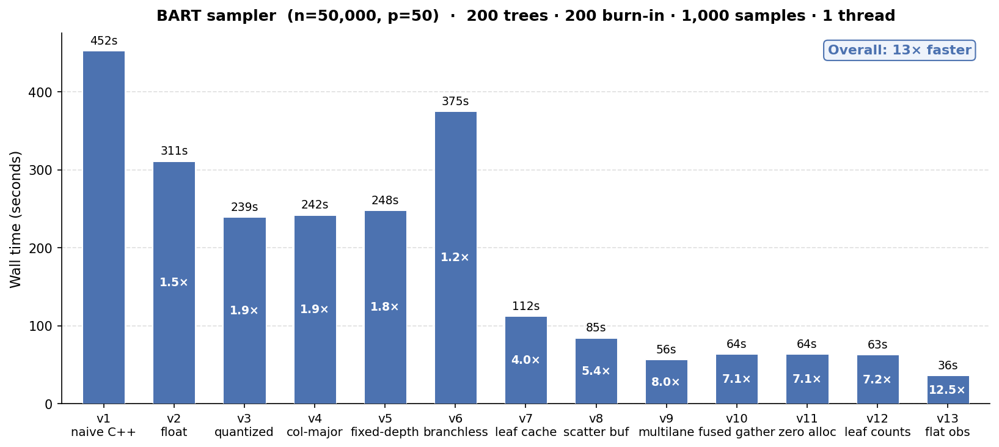
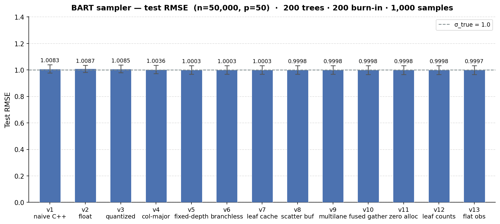
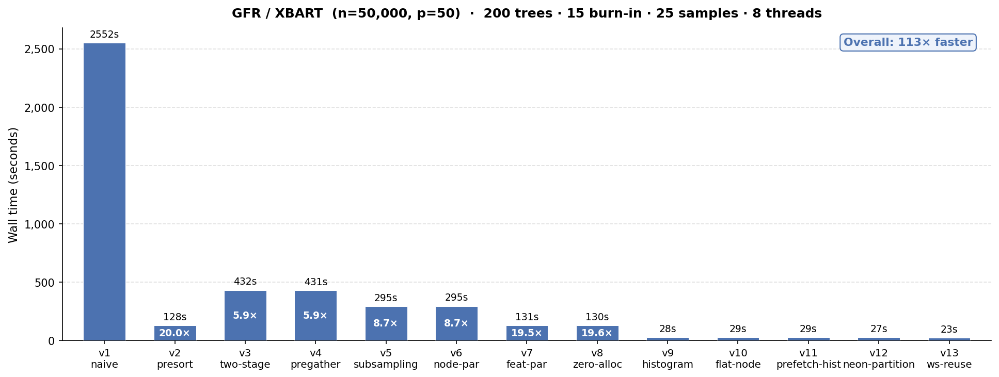
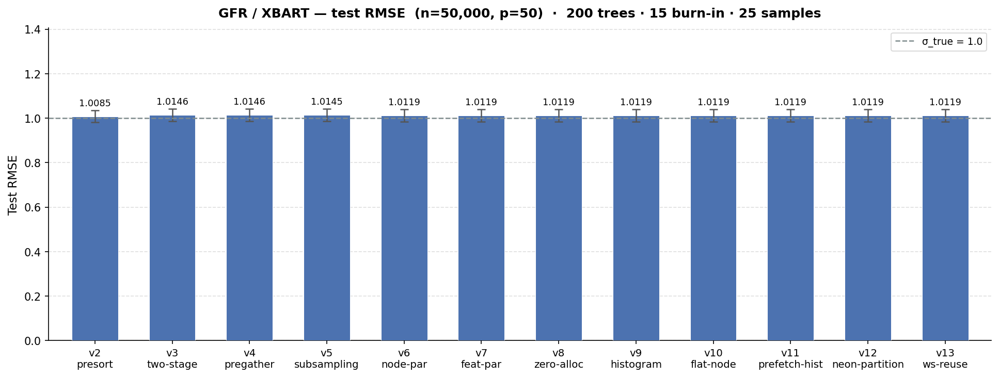

In which I use Claude Code to build a streamlined version of BART that runs 20x faster than the naive implementation on an M1 Macbook Pro.

## Why?

Tree ensembles have played a big role in my career, both in my PhD research and my postdoc work. I built [stochtree](https://stochtree.ai/) with my collaborators to make it easier and faster to fit [BART](https://projecteuclid.org/journals/annals-of-applied-statistics/volume-4/issue-1/BART-Bayesian-additive-regression-trees/10.1214/09-AOAS285.full)-based models in R and Python.

What is BART, you ask? Think of it as the Bayesian version of [xgboost](https://github.com/dmlc/xgboost) or [lightgbm](https://github.com/lightgbm-org/LightGBM). Why use it, instead of one of those two?

1. It's straightforward to compose BART models with other modeling components like linear regression or random effects, especially using [stochtree's low-level interface](https://stochtree.ai/vignettes/custom-sampling.html)
2. It returns a distribution of models, not a single model like xgboost, which allows for uncertainty intervals and advanced interpretability methods like [posterior summarization](https://www.tandfonline.com/doi/abs/10.1080/10618600.2020.1796684)

For more detail, [this post](https://stochtree.ai/about.html) gives a brief overview of "stochastic tree models" and the original [BART](https://projecteuclid.org/journals/annals-of-applied-statistics/volume-4/issue-1/BART-Bayesian-additive-regression-trees/10.1214/09-AOAS285.full) and [XBART](https://arxiv.org/abs/2002.03375) papers are great references.

The main "downside" of BART-based models is that they require sampling a large number of tree ensembles, as opposed to fitting a single ensemble as with xgboost and lightgbm. Some of this "cost" is recovered by the fact that gradient boosting libraries require a lot hyperparameter tuning. But from a pure software optimization standpoint, xgboost and lightgbm are undeniably ahead. Both have hundreds of contributors on Github across thousands of commits. Most BART packages ([BART](https://cran.r-project.org/web/packages/BART/index.html), [stochtree](https://github.com/StochasticTree/stochtree/), [dbarts](https://github.com/vdorie/dbarts), [flexBART](https://github.com/skdeshpande91/flexBART)) are developed and maintained by a small number of academic researchers and industry collaborators.

The central question of this project is -- how much faster **could** we fit BART models if we were optimizing for low-level performance alone, like xgboost and lightgbm?

Giacomo Petrillo's [bartz](https://github.com/bartz-org/bartz) project implements a minimalist BART model in [jax](https://github.com/jax-ml/jax) for some very impressive GPU performance gains. Seeing what was possible with CUDA / Jax led me to wonder whether similar performance gains can be made on Apple Silicon using C++ alone. I wanted this for two reasons:

1. Apple Silicon laptops / desktops are extremely common in tech and academia, so it stands to reason that users would find value in a fast BART library that makes full use of their laptop hardware
2. Building the project in pure C++ enables linkage to either R or Python (or other languages if we expose a C API), and many of our users prefer R

## How?

*[Enter Claude]*

Like much of the internet, I began to discover [Claude Code](https://code.claude.com/docs/en/overview) in late 2025 / early 2026 and gradually began using it for more and more advanced development work.

Eventually I decided to see if I could use Claude to mirror bartz's performance boost on Apple Silicon. My first thought was to simply replace jax with [mlx](https://github.com/ml-explore/mlx/), but the API and computation model of the two frameworks differ enough to make that a nonstarter. So then I tried to get Claude to adapt bartz's "branchless" BART model to the Apple Silicon GPU via [metal](https://developer.apple.com/metal/). Initial results were not very promising on the GPU, for reasons that I will explain on a future blog post.

From there, the goal shifted. Apple Silicon machines have excellent CPUs; why not fine tune the algorithm for fast laptop-based CPU performance?

After several sessions of prompting and guidance, Claude had generated a speedy CPU BART sampler. The end result alone was already worthwhile -- a fast BART sampler in a few thousand lines of C++ which could be linked to R or Python.

Ultimately, though, I am interested in figuring out what makes `stochtree` relatively slow, and what, if anything, can be done about that. So I prompted a "scaffolded" rollout of the performance tricks that made BART relatively fast on my Macbook Pro, to assess their individual effect.

## A Fast BART MCMC Sampler

Armed with a fast working implementation of BART, I wanted to decompose it into a series of specific improvements to gauge what has the biggest impact. I prompted Claude to start with a "naive" implementation of BART written in as little code as possible without any obvious performance tricks.

### Results

We'll talk about the results first, rather than make you read through several pages of C++ minutiae. All benchmarks are run on an Apple M1 Max laptop with 10 cores and 64 GB RAM.

We take BART from a "naive" working implementation that runs 1200 iterations (200 burnin + 1000 samples) of 200 trees on n = 50k, p = 50 in ~8 minutes to a fine-tuned version that runs 20x faster in 25 seconds.



We see a minimal impact on the test set RMSE of the benchmark we ran (the true error standard deviation is 1), but it is noteworthy that some of the software improvements appear to "coarsen" the model fit slightly in a way that degrades performance. For many use cases, getting to an RMSE of 1.03 in 25 seconds is far better than an RMSE of 0.99 in 8 minutes, but it is worth noting that these runtime gains aren't a one-off Pareto improvement.



### Comparison to existing software

We can compare the runtimes above to several common BART R packages: BART, stochtree, flexBART, and dbarts. While any comparison will not be completely apples-to-apples given `faststochtree` is a C++ CLI and each of the R packages has a slightly different sampling approach, we control what we can. We run the same number of samples of the same number of trees for the same data-generating process with the same dimensions.

We can see in the table below that each of the R packages attains a slightly lower test-set RMSE, with `dbarts` and `flexBART` as the fastest implementations and `BART` as the slowest, while `faststochtree` is 3x faster than dbarts.

| Package             | Mean runtime (s) | Mean RMSE |
| ------------------- | ---------------- | --------- |
| faststochtree (v13) | 36               | 1.00      |
| dbarts              | 73               | 0.99      |
| flexBART            | 107              | 0.99      |
| stochtree           | 190              | 0.99      |
| BART                | 382              | 0.99      |

[This colab notebook](https://colab.research.google.com/github/andrewherren/faststochtree/blob/main/bench/bench_bartz.ipynb) allows for a quick run of this same benchmark dataset against bartz, which runs in roughly 11s on a T4 GPU for a similar test set RMSE.

### BART Performance Scaffold

#### v1: Minimal BART

This implementation contains nothing more than the "bare bones" needed to run the BART MCMC sampler:

- Decision tree class, stored as a vector of node objects
- Forest class, stored as a vector of decision trees
- Covariates and outcome data, in `double` precision in C++ with covariates arranged in row-major fashion
- Data structures to store config (inputs) to BART, as well as sampler outputs
- Functions that accumulate sufficient statistics, compute log marginal likelihoods, and sample from the relevant posterior distributions

No popular BART implementations I am aware of are this minimal -- most include one or more of the performance boosts included later in this post.

#### v2: Storing data as single-precision `float`

Computers store data in bits -- 0s and 1s whose arrangement can store large integer or floating-point numbers. Floating point numbers stored as `double` occupy 64 bits while a `float` requires only 32 bits.

For algorithms that process a large amount of floating point data, the size of each individual datum and the speed with which data can be loaded into the processor is often influential. And indeed, when we change nothing about our naive BART implementation except to replace `double` with `float` throughout the codebase, we see a roughly 1.5x improvement in the sampler's runtime on a benchmark program, with a minimal impact on test-set RMSE.

#### v3: Quantizing covariates

Rather than store numeric covariates in their original floating-point scale, we can compute a predetermined number of quantiles for each covariate and store covariates in integer-valued "bins" defined by the quantile range of an observation's raw floating point value. This transformation converted covariates from `float` to `uint8_t`, further simplifying their storage and processing.

v3 yields a ~1.9x runtime improvement over v1 on the same benchmark, with a similar small impact on RMSE.

We note that several popular BART libraries use this technique (though not `stochtree` at the moment).

#### v4: Column-major storage

Row-major storage turns a matrix into a flat array row-by-row, so that the `(i, j)` element of the matrix is accessed from the `i * num_cols + j` element of the flat array. Column major storage inverts this, so that the `(i,j)` element of a matrix is accessed via the `j * num_rows + i` element of the flat array.

When we switch from row-major to column-major storage for the covariates, we see no improvement over v3. (Though column-major storage matters much more for the XBART algorithm, which we'll discuss later.)

#### v5: Fixed-depth trees

One of the key design decisions of `bartz` was to use trees of a fixed maximum depth. This is in part because the storage requirements of the model become predictable and can be pre-allocated and in part because it enables a "branchless" version of the tree traversal algorithm (see the next section).

Fixing the depth of a tree at $k$ allows us to store the decision tree differently. With a maximum of $2^{k+1} - 1$ nodes, we can pre-allocate several parallel arrays that store the information for these nodes. Each node indexed by `idx` is stored such that its left node is stored at `2*idx+1` and its right node is stored at `2*idx+2`. `faststochtree` defaults to a max depth of `k=6`, as with `bartz`.

We find that fixing the depth of the trees and the associated storage changes on their own increase runtime slightly over v3 and v4 on an apple silicon CPU.

#### v6: Branchless traversal

Determining the leaf node index for observation `i` from a covariate matrix `X` for a tree `tree` requires "traversing" the tree, as in the pseudocode below

```pseudocode
node = tree.root
while node is not leaf:
    split_variable = node.split_variable
    split_threshold = node.split_threshold
    if X[i, split_variable] <= split_threshold:
        node = node.left
    else:
        node = node.right
```

Branched computation like this requires a processor to selectively execute one instruction or another based on the output of a previous instruction. This can be a problem for CPUs, which [attempt to predict which branch will execute](https://en.wikipedia.org/wiki/Branch_predictor) and pre-load its instructions, and even more so for GPUs, where [warps (in CUDA parlance) or simdgroups / wavefronts load and execute the same instructions on multiple threads](https://docs.nvidia.com/cuda/cuda-programming-guide/01-introduction/programming-model.html#thread-blocks-and-grids).

With fixed-depth trees, the while loop above can be converted to a for loop (where `split_variables` and `split_thresholds` are now two parallel arrays) (see [Petrillo (2025)](https://arxiv.org/abs/2410.23244) for more detail)

```pseudocode
node_idx = 0
is_leaf = False
for depth in 0 to max_depth - 1:
    split_variable = split_variable[node_idx]
    split_threshold = split_threshold[node_idx]
    is_leaf = is_leaf or split_threshold = 0
    next_node_idx = 2 * node_idx + 1 + (X[i, split_variable] > split_threshold)
    node_idx = node_idx if is_leaf else next_node_idx
```

Note that `split_threshold = 0` is a [sentinel value](https://en.wikipedia.org/wiki/Sentinel_value) that indicates a leaf node, as covariates have already been coarsened to quantile bins.

We see that on CPU without any special accommodations for parallelism or hardware acceleration, this branchless traversal is actually slower (because it does strictly more work than v5).

#### v7: Leaf node caching

All of the BART implementations up to this point have had to re-traverse a tree at each MCMC proposal step to determine which observations fall into a given node (so that the data in this node can be used for a grow / prune proposal). This update adds a leaf cache vector that stores the node index of every training set observation in every tree, so that determining whether element `i` falls into node `k` does not require a tree traversal (which has logarithmic complexity in the depth of a tree).

This update provides the biggest performance boost observed so far, since we avoid a costly per-update traversal. Note that many popular BART libraries, including `stochtree`, do some version of this.

#### v8: Scatter buffer

The original "unoptimized" implementation of BART updated leaf nodes after each tree step by placing the sufficient statistics of each leaf into a `std::unordered_map` (a lookup table) and accumulating sufficient statistics into the relevant portion of the table. Replacing this lookup table with two parallel vectors with elements for each leaf node cuts runtime from v7 by 30s, for an overall 5.4x speedup over the "naive" implementation.

As with v3 and v7, this technique is already implemented in many BART libraries.

#### v9: Multilane accumulation

The existing leaf node update code looks something like

```cpp
for (int i = 0; i < n; i++) {
    int k = leaf_idx[i];
    sum_buf[k] += resid[i];
    cnt_buf[k]++;
}
for (int k = 1; k < sz; k++) {
    if (cnt_buf[k] == 0) continue;
    float post_mean = (tau * sum_buf[k]) / (cnt_buf[k] * tau + sigma2);
    float post_var  = (tau * sigma2)      / (cnt_buf[k] * tau + sigma2);
    tree.leaf_value[k] = post_mean + std::sqrt(post_var) * rng.normal();
}
```

This has a data dependency known as [Load-Hit-Store](https://en.wikipedia.org/wiki/Load-Hit-Store) or "store-to-load hazard." CPUs generally try to work efficiently through sequential operations like the loop above with [instruction pipelining](https://en.wikipedia.org/wiki/Instruction_pipelining), where instructions are overlapped as much as possible. But an operation like `sum_buf[k] += resid[i];` requires determining the location of `sum_buf[k]`, loading its value, modifying it, and storing the updated value in `sum_buf[k]`. Iteration `i` and iteration `i+1` both depend on arbitrary access to the `sum_buf` buffer, so the CPU must account for the possibility of waiting for the store of `sum_buf[leaf_idx[i]]` to complete before loading `sum_buf[leaf_idx[i+1]]` when `leaf_idx[i] == leaf_idx[i+1]`.

This can be partially mitigated with "multi-lane accumulation," in which several buffers are updated independently and then merged at the end, like below:

```cpp
int   sz  = tree.full_size + 1; // Cannot be more than 128
float s0[128]={}, s1[128]={}, s2[128]={}, s3[128]={};
int   c0[128]={}, c1[128]={}, c2[128]={}, c3[128]={};

int n4 = (n / 4) * 4;
for (int i = 0; i < n4; i += 4) {
    int l0 = leaf_idx[i],   l1 = leaf_idx[i+1],
        l2 = leaf_idx[i+2], l3 = leaf_idx[i+3];
    s0[l0] += resid[i];   c0[l0]++;
    s1[l1] += resid[i+1]; c1[l1]++;
    s2[l2] += resid[i+2]; c2[l2]++;
    s3[l3] += resid[i+3]; c3[l3]++;
}
for (int i = n4; i < n; i++) {
    int k = leaf_idx[i];
    s0[k] += resid[i]; c0[k]++;
}
for (int k = 1; k < sz; k++) {
    int   cnt = c0[k] + c1[k] + c2[k] + c3[k];
    if (cnt == 0) continue;
    float sum = s0[k] + s1[k] + s2[k] + s3[k];
    float post_mean = (tau * sum) / (cnt * tau + sigma2);
    float post_var  = (tau * sigma2) / (cnt * tau + sigma2);
    tree.leaf_value[k] = post_mean + std::sqrt(post_var) * rng.normal();
}
```

This update provides another major computational step change in the BART performance scaffold, bringing total runtime down to 56 seconds for an 8x improvement over the naive implementation.

#### v10: Fused scatter-gather

BART samples a tree ensemble one tree at a time via [Bayesian backfitting](https://hastie.su.domains/TALKS/gibbsgam.pdf), where each tree $j$ fits the "partial residual" $y_i - \sum_{k \neq j} g_k(X_i)$ where $\sum_{k \neq j} g_k(X_i)$ is the prediction of every tree except $j$ for observation $i$. Up to v9, this is done via four passes through the data:

1. Add stored $g_j(X_i)$ to the full residual for tree $j$'s partial residual ($y_i - \sum_{k \neq j} g_k(X_i)$)
2. Accumulate sufficient statistics for model updates by reading directly from the partial residual
3. *[After updating the tree and its leaf values]* Store recomputed $g_j(X_i)$ for every $i$
4. Subtract $g_j(X_i)$ from the partial residual for the "full residual" (outcome minus forest predictions)

We can reduce this to two passes by storing predictions for every tree and every observation:

1. Accumulate sufficient statistics for model updates by reading the full residual for each observation and adding the stored $g_j(X_i)$
2. *[After updating the tree and its leaf values]* Store recomputed $g_j(X_i)$ for every $i$ and subtract the change in predicted value from the full residual

This update presents a slight runtime regression over v9, for reasons that I don't fully understand at the moment. Perhaps the compiler is able to easily auto-vectorize the "extra" $O(n)$ residual passes in v9 and saving these two passes is more than offset by the complicated memory access patterns in v10 (as the sufficient statistic updates read from the full residual and the prediction cache)? I intend to look into this further in the future and perhaps scaffold v13 directly on top of v9.

#### v11: Scratch workspace pre-allocation

This update pre-allocates a "workspace" with arrays for all of the sufficient statistic calculations to avoid new allocations for each tree update. We see that this offers little runtime improvement.

#### v12: Storing leaf node counts

Since the number of observations in a leaf node does not depend on the (forest-dependent) partial residual, these "counts" can be stored per-tree and retrieved during sampling operations, rather than recomputed with the outcome sufficient statistics.

As with v11, this update does not improve the benchmark's runtime.

#### v13: Sifted leaf node observation buffer

Every tree update requires a node-specific proposal (grow or prune) which means assembling the data that fall into a given node. Through v12 this was done by iterating through every observation and checking which observations fall into node `j`. We can alternatively maintain a buffer of observation indices, initially arranged in ascending order from 0 to `n-1`, which is partitioned each time a node is split so that the observations for node `j` can be determined by offsets into this buffer.

Concretely, if we started with an observation buffer `[0,1,2,3,4,5,6]` and partitioned the root node so that observations 0, 3, and 4 are in the left node and 1, 2, 5, and 6 are in the right node, the buffer would sift into `[0,3,4,1,2,5,6]`, with "start index" offsets of `[0,0,3]` and "end index" offsets of `[7, 3, 7]` for nodes 0, 1 and 2.

This update improves benchmark runtime from 63 seconds to 36 seconds. We note that several BART packages, including `stochtree`, include a variant of this technique.

## A Fast XBART / Grow-From-Root Sampler

[XBART](https://arxiv.org/abs/2002.03375) is an adaptation of BART that incorporates elements of the "greedy" training approach of xgboost / lightgbm to fit a dataset in fewer iterations than would be required by a BART model. XBART's greedy algorithm is called "grow-from-root" which I'll sometimes abbreviate as GFR in this post for brevity. `stochtree` supports both BART and XBART interchangeably, and a common use case of XBART is to "warm-start" initialize a BART MCMC chain.

Given the importance of XBART in my own work and to many of `stochtree`'s users, I also wanted to see how fast we can make this algorithm.

### Results

As with BART, we'll talk about the results first, and all benchmarks are run on an Apple M1 Max laptop with 10 cores and 64 GB RAM.

We take XBART from a "naive" working implementation that takes over 40 minutes to sample 40 iterations (15 burnin + 25 retained) of 200 trees on n = 50k, p = 50 to a fine-tuned version that runs 119x faster in 23 seconds.



We see a minimal impact on the test set RMSE of the benchmark we ran (the true error standard deviation is 1 as with the MCMC example). Note that `v1` is omitted from the RMSE comparison. With a runtime of >40 mins, it was both unnecessary and prohibitive to run 30 iterations of the benchmark suite as with every other implementation. This makes its benchmark RMSE apples-and-oranges with the other versions. In terms of model fit, `v2` is materially the same implementation, just avoiding an obvious performance limitation.



### Comparison to existing software

We can compare the runtimes above to two XBART R packages: [XBART](https://github.com/JingyuHe/XBART) and [stochtree](https://stochtree.ai/). As with BART, comparisons between R packages and a C++ CLI are not completely apples-to-apples, but we make every effort to run the same number of samples of the same number of trees for the same data-generating process with the same dimensions.

We can see in the table below that both of the R packages attain a slightly lower test-set RMSE, with `XBART` as the faster implementation[^1].

| Package             | Mean runtime (s) | Mean RMSE |
| ------------------- | ---------------- | --------- |
| faststochtree (v13) | 23               | 1.01      |
| XBART               | 39               | 0.99      |
| stochtree           | 87               | 0.99      |

### XBART Performance Scaffold

#### v1: "Naive" XBART

We started with a "naive" implementation of XBART which follows the prescribed steps articulated in Algorithm 2 of [the XBART paper](https://arxiv.org/abs/2002.03375) with no attempt at performance tuning. This implementation is based on the `faststochtree` infrastructure available as of MCMC [v11](#v11-scratch-workspace-pre-allocation), meaning it has:

1. Fixed-depth trees with a branchless traversal method, 
2. Quantized covariates (stored in a maximum of 255 quantile bins), and 
3. Multilane accumulation of sufficient statistics

`v1` earns its "naive" title with an average runtime of over 40 minutes! Note that this version was only benchmarked three times (as opposed to 30 for every other benchmark in this post), since the 40 minute runtime didn't need many iterations to show its contrast.

#### v2: Presorted features

The XBART paper recommends [arg-sorting](https://numpy.org/doc/2.2/reference/generated/numpy.argsort.html) features (i.e. arranging the data indices in a way that places each covariate's values in ascending order) before performing the recursive scans that define the algorithm. The reason for this is made immediately clear by a runtime reduction from 41 minutes in `v1` to 2 minutes in `v2`!

Note that both `stochtree` and `XBART` maintain covariate sort indices in their GFR implementations. Even though the GFR algorithm does not explicitly require pre-sorted covariates, the method as described in the paper is clear about the importance of presorted covariates for performance, and we should consider `v2` as the "starting point" of this experiment.

#### v3: Two-stage cutpoint sampling

The GFR algorithm enumerates a range of available split rules available to each node. The simplest way to do this is to consider splitting on each unique value of each variable in ascending order (except for the final value). If node `k` has `num_unique_k` unique values for each covariate (with quantized covariates `num_unique_k` is at most 255), then we evaluate `p * (num_unique_k - 1)` potential splits (where `p` is the number of features) and store as many log-likelihoods in a vector. After appending a "no-split" log-likelihood, we take a weighted draw from this vector to define the next move (split or no-split).

Rather than sample the split rule in a single step, with every combination of feature and split value enumerated and evaluated, we can run the same procedure in two stages:

1. Compute each feature's total split log-likelihood, sample a feature to split based on these values
2. Enumerate split rule candidates for the selected feature and sample a new split rule from the available candidates

This update induces a fairly significant performance regression (runtime increases ~3.5x), and it's worth understanding why. Setting up the "stage 1" sampling step has a higher overhead than simply populating a vector of length `p * (num_unique_k - 1)` as in `v1`/`v2`, because this is a fairly "naive" implementation of the two-stage approach, which will be refined in later iterations. Specifically, 

* memory is still allocated for `p * (num_unique_k - 1)` split evaluations, but it's done as a vector-of-vectors which is re-allocated frequently rather than a single large vector,
* the two-stage approach makes three passes of the data per feature in a node where the first approach made a single pass per feature,
* a maximum log-likelihood is computed online during one of the data passes, which "branches" the inner loop and makes the code less vectorizable.

So why not revert to `v2`? We will see that the infrastructure of `v3` enables several future experiments and optimizations. (**Note**: it is on the agenda to see whether the `v3` update can be sidestepped entirely, with some of the later optimizations folded directly into `v2`.)

#### v4: Pre-gathering residuals before cutpoint scans

The "hot path" of the GFR algorithm is the per-feature split rule evaluations. With feature sort indices pre-computed, this process looks something like

```cpp
// Assume feature_sort_indices is a nested vector of 
// p elements, each with n integer indices indicating 
// the rank of each covariate value in ascending order 
// 
// Assume residual is an n-vector of partial residuals 
// needed for sufficient statistic calculations
for (int j = 0; j < p; j++) {
  for (int i = 0; i < (n_k - 1); i++) {
    int data_idx = feature_sort_indices[j][i];
    double resid = residuals[data_idx];
    // ... Accumulate sufficient statistics
    // ... Compute log-likelihoods
  }
}
```

This is relatively slow since each loop iteration accesses `residual` in an arbitrary fashion (i.e. `data_idx` could be 10 when `i = 0` and 40000 when `i = 1`). Modern CPUs have many optimizations for predictable data access patterns (for example if `residual` were accessed by the loop variable `i`), so v4 attempts to mitigate the arbitrary access problem with an explicit [gather](https://en.wikipedia.org/wiki/Gather/scatter_(vector_addressing)#Gather) step that packs each `residuals[data_idx]` element into a temporary buffer:

```cpp
for (int i = 0; i < (n_k - 1); i++) {
  int data_idx = feature_sort_indices[j][i];
  resid_buffer[i] = residuals[data_idx];
}
for (int i = 0; i < (n_k - 1); i++) {
  double resid = resid_buffer[i];
  // ... Accumulate sufficient statistics
  // ... Compute log-likelihoods
}
```

Ultimately, the second loop's cache-friendliness and [potential for auto-vectorization](https://en.wikipedia.org/wiki/Automatic_vectorization) doesn't mitigate the data access done in the first loop and this update proves to have no effect on runtime.

#### v5: Feature subsampling

While GFR typically "converges" with fewer samples or iterations than MCMC, this comes at the expense of evaluating `p * n_k` potential splits recursively for each node `k` until the tree has stopped splitting. When `p` is large, the work involved in this enumeration is substantial and some of these features may be "noise" from the perspective of obtaining a good model fit.

We can reduce the amount of work done by randomly selecting a subset `p_subset` of features and only evaluating `p_subset * n_k` potential splits for each node. This raises a natural objection -- "what if we omit an important feature?" -- which is partially mitigated by the fact that we evaluate a different subset of features at every node of every tree, leaving hundreds / thousands of opportunities to select and evaluate the "correct" features. 

This update also removes some of the inefficient work introduced and discussed in the [v3](#v3-two-stage-cutpoint-sampling) section for a "less naive" two-pass design (i.e. splits are not enumerated up front as a vector-of-vectors in stage 1).

As with the reference implementation of XBART, `v5` defaults to subsampling $\sqrt{p}$ features, rounded to the nearest integer. With `p=50` features in the benchmark evaluation, `v5` reduces runtime from over 7 minutes to just under 5 minutes, with no impact on test-set RMSE.

#### v6: Node-parallel sampling

So far, all of the computational work discussed above (including all of the BART implementations) have been performed on a single thread. `v6` is the first earnest attempt at making greater use of a computer's hardware. Rather than use OpenMP, a [simple custom threadpool](https://github.com/andrewherren/faststochtree/blob/v12-leaf-counts/include/faststochtree/thread_pool.hpp) dispatches independent blocks of work to different threads.

The first approach to multithreading in `faststochtree` involves parallelizing the work done by independent nodes at the same level of a tree. A simple tree with a single split has two leaf nodes that partition the data into mutually-exclusive regions, so their split candidates can be evaluated by different threads with no data dependency. 

This update has almost no effect on runtime, as the overhead of multi-threading outweighs the gains from processing relatively few nodes in parallel. Consider a shallow tree with two leaf nodes. At `n=50000`, each node likely contains a lot of data, but node-parallelism means the program deploys two threads to process this data concurrently. In contrast, a comparatively deep tree with 128 leaf nodes provides many independent "blocks of work" to be processed by different threads, but each block of work will be relatively "small" as each node contains few observations.

#### v7: Feature-parallel sampling

`faststochtree`'s second attempt at multithreading processes **features** independently at each node's cutpoint evaluation. This update reduces runtime substantially, from roughly 5 minutes to 2 minutes, with no effect on test set RMSE.

#### v8: Persistent partition tracker object

The GFR implementation defines a `TreePartition` object that maintains a copy of the sort indices for each feature which partitions as a tree grows. For example, suppose feature 0 is sorted by the following indices at root (node 0): `[6,8,3,4,1,5,2,0,7]`. If node 0 is partitioned, we must "re-arrange" these sort indices so that we know how to place feature 0 in ascending order within nodes 1 and 2. Suppose that converts `[6,8,3,4,1,5,2,0,7]` into `[3,4,1,5,6,8,2,0,7]` for feature 0, we must also now maintain "begin" and "end" indices for our new nodes. In this case, node 1 begins at position 0 and ends at position 4, while node 2 begins at position 4 and ends at position 9. Note that we must maintain sifted sort indices (i.e. `[3,4,1,5,6,8,2,0,7]`) for each feature, but the node `[begin, end)` tracker is repeated.

`v8` turns this object from temporary state which is created and destroyed each time a new tree is sampled into a "persistent" object which is reset at each new tree. Ultimately, this update has little effect on runtime.

#### v9: Histogram-based split evaluation

This update takes advantage of the fact that, with quantized features, there are at most 255 possible split points for every feature. Splits are evaluated by a `log_marginal_likelihood` function that takes two sufficient statistics, 
1. the number of observations on the left and right sides of a proposed split, and 
2. the sum of partial residuals on the left and right sides of a proposed split. 

The way `faststochtree` from v2 to v8 computed this was to
1. iterate through a feature's "sort indices" for a given node, 
2. accumulate the two sufficient statistics, 
3. compute the log marginal likelihood using the current values of the sufficient statistics whenever a feature value changed.

This requires maintaining sort indices for each feature, which has an `O(n_k * p)` update cost after each partition (i.e. to sift the sort indices into their respective node positions for every feature). `v9` replaces feature-specific sort indices with an unsorted vector of indices that sifts as the tree grows. This vector (which we'll call `flat_obs`) is used to populate histograms of the sufficient statistics for every feature, as in the simplified code below
```cpp
// j is the current feature being evaluated
// begin_k and end_k are positions of node k in the flat_obs index vector
for (int i = begin_k; i < end_k; i++) {
  // Get the raw data index of the observation indexed by i in node k
  int obs_idx = flat_obs[i];
  // Get the covariate j bin value of observation obs_idx
  int bin_idx = covariates.at(obs_idx, j);
  // Add the partial residual for obs_idx and increment the count for each histogram at bin_idx
  sum_hist[bin_idx] += residual[obs_idx];
  count_hist[bin_idx] ++;
}
```

This histogram construction step is `O(n_k * p_subset)`. Once each feature's histogram is constructed, evaluation involves an `O(p_subset * 255)` scan. After a split is made, a single `O(n_k)` partition of `flat_obs` is required, **in contrast to** the `O(n_k * p)` update of the sort indices in v8.

And indeed, the impact of this change is sizable, taking runtime from over 2 minutes to 28 seconds with no impact on test set RMSE!

#### v10: Flat buffer for node range trackers

This is a bookkeeping update that switches the underlying datastructure that stores begin and end indices for each node in a tree from a `std::unordered_map` to a `std::vector` and it has minimal runtime impact.

#### v11 and v12: Platform-dependent optimizations

v11 uses `__builtin_prefetch` to attempt to make the histogram construction more cache-friendly. This update has almost no runtime impact, and requires platform-specific handling of the prefetch instruction (`__builtin_prefetch` is implemented in gcc and clang, but making this work on MSVC x86/x64 would require selectively dispatching `__mm_prefetch` based on detected platform).

v12 uses [NEON](https://developer.arm.com/Architectures/Neon) SIMD intrinsics[^2] to more efficiently partition observations after a split, for a slight performance improvement from 29s to 27s.

#### v13: Reusing partition tracker for leaf sampling

GFR has two steps: (1) grow a tree stochastically until some stopping criterion is met (i.e. the max depth has been reached or the algorithm has stopped splitting) (2) sample leaf node values for the newly-grown tree.

Prior to v13, `faststochtree` determined which observations fell into a given leaf node by re-traversing a tree. v13 uses the `flat_obs` partition tracker to avoid this costly traversal, for a runtime improvement from 27s to 23s.

## Summary

### BART

The most impactful runtime performance optimizations for BART appear to be

1. Quantization of covariates and the use of single-precision for outcome data
2. Maintaining a cache of observation to leaf node assignments
3. Storing leaf sufficient statistics in a contiguous buffer
4. Updating sufficient statistics in a "multi-lane accumulation" pattern
5. Maintaining a pre-partitioned buffer of observations in a node

Many of these techniques are already used in various BART libraries (for example, `stochtree` does variants of 2, 3, and 5).

### XBART

The most impactful runtime performance optimizations for XBART appear to be

1. Pre-sorting of covariates[^3]
2. Feature sub-sampling
3. Feature-parallel cutpoint enumeration
4. Evaluating cutpoints via histogram

1 and 2 are supported by both `stochtree` and `XBART` and 3 is also supported by `stochtree` (though it is implemented with OpenMP as opposed to a custom thread-pool).

## Next steps

1. Future blog posts will explore the challenges / difficulties of achieving a substantial speedup on the Apple Silicon GPU for both algorithms
2. Development roadmap for `faststochtree`:
  * Support for ordered categorical covariates
  * Extending the fast BART implementation to a two forest "fast BCF" interface for causal inference use cases
3. Development roadmap for `stochtree`:
  * BART: given the substantial impact of quantization, single precision and multi-lane sufficient statistic accumulation, it will be interesting to determine whether these techniques can be introduced into `stochtree` for similar performance gains
  * XBART: given the performance impact of histograms for split evaluation, it would be nice to gauge the extent to which this helps `stochtree`

[^1]: Note that there is substantial variation in the faststochtree test set RMSE within each of the 10 iterations of the benchmark suite I ran, so I intend to rerun this experiment for more iterations to see if the test set RMSE averages out closer to its competitors' performance
[^2]: The code checks for the availability of NEON instructions with `#ifdef __ARM_NEON` and for compatibility with `__builtin_prefetch` with `#ifdef __GNUC__`, so it still works on all major platforms
[^3]: It is fair to say that the algorithm is only viable with pre-sorted covariates
